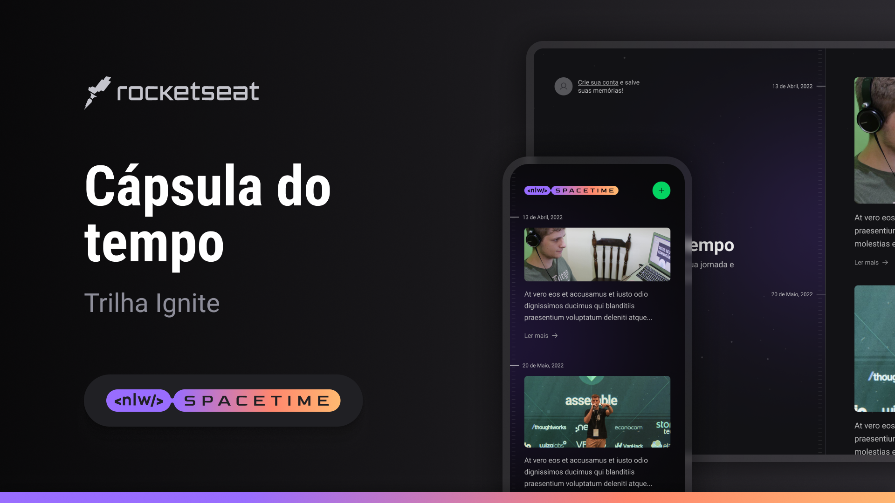

<h1 align="center">NLW Spacetime</h1>

Esse projeto foi desenvolvido durante o evento da empresa Rocketseat o NLW Spacetime 

 

  

## 🚀 Tecnologias

Esse projeto foi desenvolvido com as seguintes tecnologias:

## 🖥 FRONT-END WEB:
- Typescript
- Next JS
- Tailwind CSS
- Autoprefixer
- Postcss
- Lucide-react
- Axios 
- Eslint
- Js-cookie
- Jwt-decode

## 📱 MOBILE
- React Native 
- React-native-safe-area-context
- React-native-screens
- React-native-svg
- Typescript
- Exgo GO
- Expo-image-picker
- Expo-auth-session
- Expo-constants
- Expo-crypto
- Expo-font
- Expo-linking
- Expo-router
- Expo-secure-store
- Expo-status-bar
- Nativewind

## ⚙ BACK-END
- Node 
- Typescript
- Prisma
- SQLite
- Zod
- Fastify
- Dotenv
- Eslint
- Fastify cors
- Fastify jwt
- Fastify multipart 
- Fastify static 
- Prisma client
- Git e Github

## 💻 Projeto

Aplicação de recordação de memórias, onde o usuário poderá adicionar à uma timeline textos, fotos e vídeos de acontecimentos marcantes da sua vida, organizados por mês e ano.
